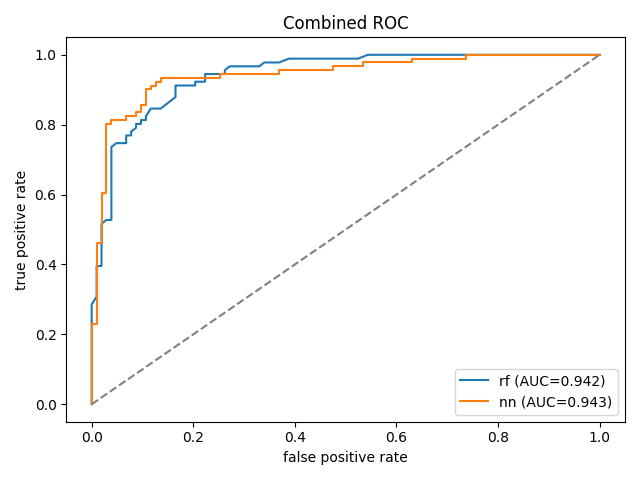
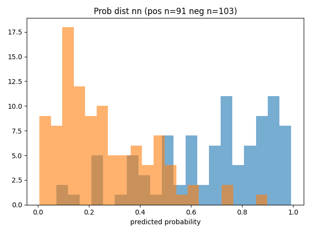

# README — quick walkthrough

Minimal guide to run the demo pipeline.  
**Important:** run the commands from the project `scripts/` directory.

---
## 0) Install
Install via pip from root directory. There may be a few light dependency requirements.

```bash
pip install -e .
```

## 1) Generate train and test data

Run the data generator to create a small training CSV.

```bash
python generate_data.py --out ../data/cancer_data_train.csv --seed 42
```
 You should see

 ```bash
 [data gen] Generating demo dataset
Arguments:
  out: ../data/cancer_data_train.csv
  n: 194
  seed: 42
  p_cancer: 0.45
[data gen] complete
 ```
---

Create a test CSV in the same way.

```bash
python generate_data.py --out ../data/cancer_data_test.csv --seed 1000
```

You should see
```bash
[data gen] Generating demo dataset
Arguments:
  out: ../data/cancer_data_test.csv
  n: 194
  seed: 1000
  p_cancer: 0.45
[data gen] complete
```
---

## 2) Train models

Train one or more models listed as a comma-separated `--models` value. The script reads the features and model configs from the JSON config file.

```bash
python train.py --models rf,nn   --input_file ../data/cancer_data_train.csv   --config_file ../configs/config_simple.json   --results_dir ../results
```

You should see
```bash
[train] data split train=155 val=39 feats=['methylation_entropy', 'age', 'bmi']
[train] building model 'rf' with cfg: {'n_estimators': 200, 'random_state': 42}
[train] -> rf
[train] fitted rf
[metrics] rf acc=0.7692 f1=0.7273 auc=0.8505
[train] saved model -> ../results/rf
[train] wrote preds -> ../results/rf/rf_val_predictions.csv
[train] wrote metrics -> ../results/rf/rf_metrics.json
[train] building model 'nn' with cfg: {'hidden_units': [32, 16], 'dropout': 0.1, 'epochs': 20, 'batch_size': 32, 'validation_split': 0.1, 'verbose': 0}
[train] -> nn
[train] fitted nn
[metrics] nn acc=0.7179 f1=0.6452 auc=0.8315
[train] saved model -> ../results/nn
[train] wrote preds -> ../results/nn/nn_val_predictions.csv
[train] wrote metrics -> ../results/nn/nn_metrics.json
[train] done. results in ../results
```
---

## 3) Predict with saved models

Point the predictor at the directory that contains model subfolders (one folder per model).

```bash
python predict.py --model_dir ../results --models rf,nn   --input_file ../data/cancer_data_test.csv   --config ../configs/config_simple.json   --out_csv ../results/combined_predictions.csv
```

You should see
```bash
[predict] loading model 'rf' from ../results/rf
[predict] predicting with 'rf'
[predict] loading model 'nn' from ../results/nn
[predict] predicting with 'nn'
[predict] wrote -> ../results/combined_predictions.csv
```
---

## 4) Run analysis and save plots

Produce simple validation plots (ROC, PR, probability histograms) and a combined ROC; prints a compact confusion matrix per model.

```bash
python analysis.py --pred_file ../results/combined_predictions.csv --save_dir ../results
```

You should see
```bash
[analysis] rf acc=0.820 f1=0.800
[confusion] rf  total=194
 TN= 89 | FP= 14
 FN= 21 | TP= 70
[analysis] nn acc=0.825 f1=0.805
[confusion] nn  total=194
 TN= 90 | FP= 13
 FN= 21 | TP= 70
[analysis] done. plots saved to ../results/plots
```

### Example analysis plots





---

## Note
- Config: `configs/config_simple.json` controls `features`, `target`, and per-model hyperparameters. Edit it to change features, test size, or model hyperparameters.
---
